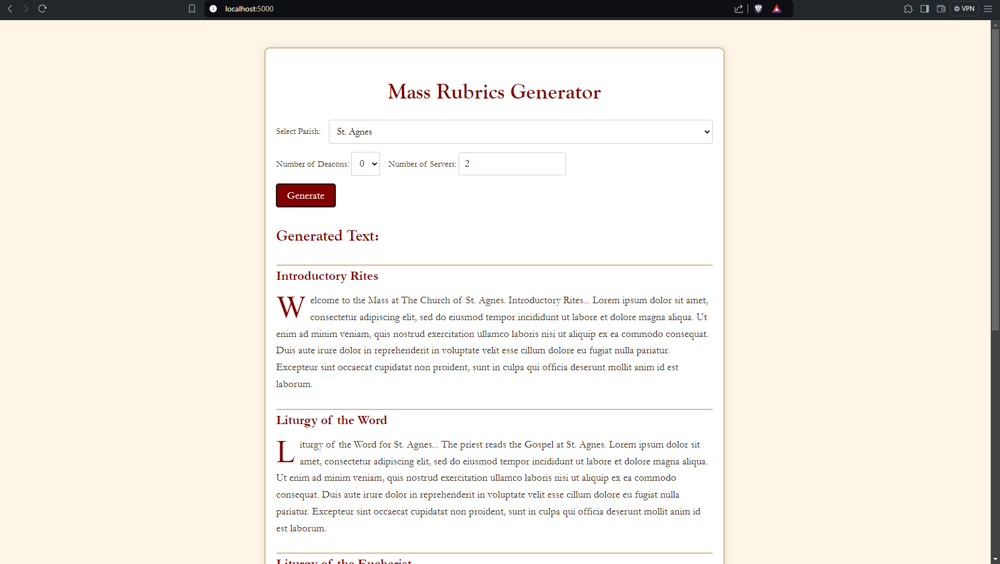
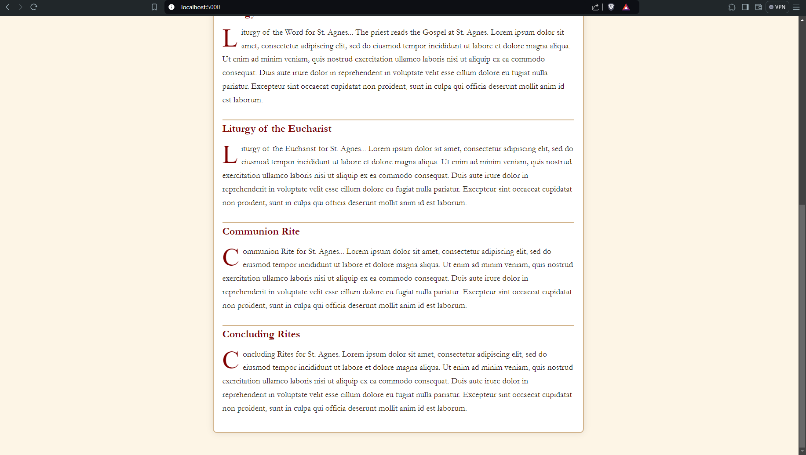
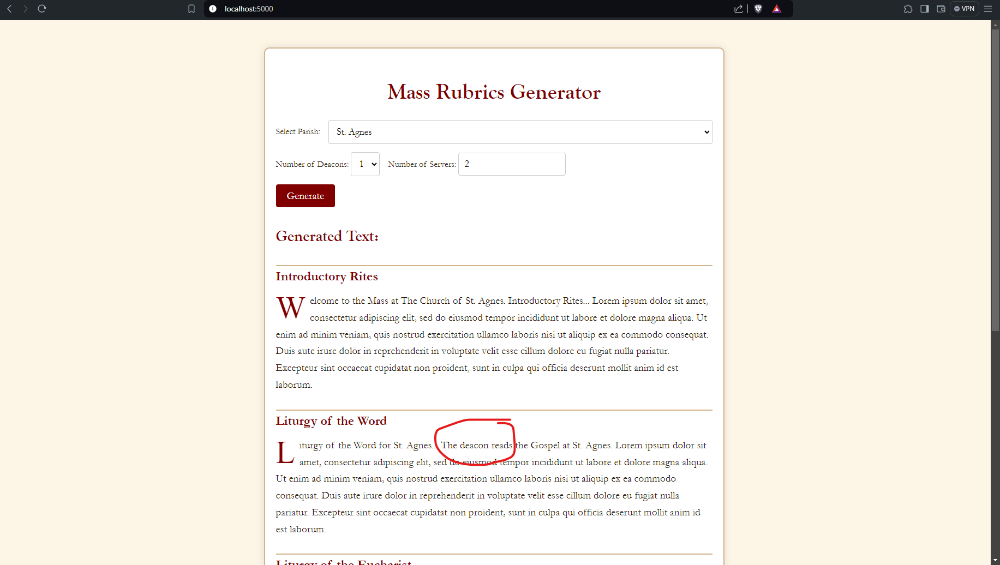
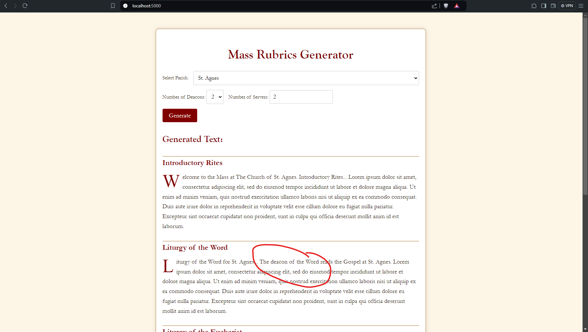

# ordo-missa-rubrica

## Summary:
The idea of this project is to have some sort of front-end display that shows the Rubrics for the Order of the Mass with sliders / options to adjust how many deacons (a dropdown with 0, 1, or 2), how many servers (a number box with way to increment and decrement the total number of servers), and maybe a few other options and how who does what changes based on each variation.

## TODOs:
- Figure out a good way to use the backend logic...  Getting a start in the `/app/ordo_missa/parishes/epiphany/` directory...
- Pretty up the front end to make it look more like a Roman Missal...
- Add in Mass types (Solemnity High, Solemnity Low, weekday, etc.) dropdown...

## Example using the Gospel Reading:
This project would need to have the ability to dynamically update certain parts of the Ordo while also having static or constant parts that don't change between options.
### The dynamic part:
This example shows how the number of deacons selected would vary.  If 0 deacons is selected, then the priest would read the Gospel.  If 1 deacon is present, then he asks the celebrant for his blessing and reads the Gospel.  If 2 deacons are present, then the Deacon of the Word asks the celebrant for his blessing and reads the Gospel while the Deacon of the Eucharist stays with the priest.
### The static part:
The Gospel is always started with "The Lord be with you" (assuming this is English, which could be another option to change), and then the Gospel read, regardless of who reads it.

### Project Initial Mockup:



### Changing the Dropdowns affecting the Application:




## Setup Instructions

To get started with the Ordo Missa Rubrica project, follow these steps:

1. **Clone the Repository:**
   - Open a terminal or command prompt.
   - Navigate to your preferred directory, e.g., `C:/CodeRepos/`.
   - Clone the repository using:
     ```bash
     git clone <repository-url> ordo-missa-rubrica
     ```
   - Navigate into the project directory:
     ```bash
     cd ordo-missa-rubrica
     ```

2. **Install Recommended VS Code Extensions:**
   - Open Visual Studio Code.
   - Install the following extensions for a better development experience by navigating to the **Extensions** page and then typing `@recommended` in the search bar to view the workspace recommended extensions.

3. **Set Up Python Virtual Environment:**
   - Open the integrated terminal in VS Code (or use your command prompt/terminal).
   - Create a virtual environment in the project directory:
     ```bash
     python -m venv .venv
     ```
   - Activate the virtual environment:
     - **Windows:**
       ```bash
       .venv\Scripts\activate
       ```
     - **Mac/Linux:**
       ```bash
       source .venv/bin/activate
       ```

4. **Install Project Dependencies:**
   - With the virtual environment activated, install the required packages using:
     ```bash
     pip install -r requirements.txt
     ```

5. **Run the Flask Application:**
   - You can run the Flask app directly from the terminal or through VS Code.
   - To start the Flask application, run:
     ```bash
     flask run
     ```
   - Alternatively, use VS Code's debugging features:
     - Navigate to the **Run and Debug** sidebar (left sidebar) and click **Run and Debug**.
     - Or, press `Ctrl + F5` to start the debugger without breakpoints.
   - If a problem occurs, try using Python 3.12.

You should now be able to view and interact with the Ordo Missa Rubrica app in your browser.
